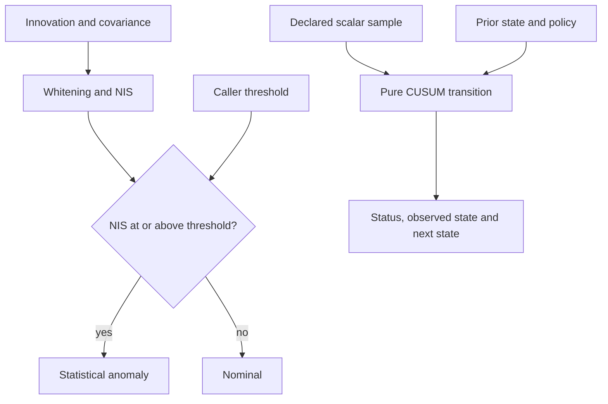

# Fault Monitor

**Monitor residuals and changes while retaining thresholds, uncertainty and diagnostic state.**

## Notation Systems and this instrument

**Notation Systems develops evidence-backed industrial intelligence and computational instrumentation, connecting expert knowledge and observations to bounded, inspectable work.** Its domains remain **PAYLOAD** (physical operations, facilities, materials and logistics, including Caravan), **LANDSHARK** (land/site and spatial constraints), and **TRADEWIND** (contracts, prices and exposure). PayloadOS/ESM govern industrial evidence/state; Dossier Services packages scoped service outputs.

This instrument owns **residual statistics and explicit diagnostic transitions**, not physical fault confirmation or equipment control. [Notations Systems Terminal (NET)](https://github.com/giasonpooni/Notations-Systems-Terminal) coordinates typed work while specialist repositories retain their mathematics and licences. Existing NET / `net` / `ciw` and `fdir` identities remain intact.

The intended expertise-amplification path is **expert input → reviewed specification → bounded execution → observations and checks → authorized integration/release**. Manufacturing, robotics, materials, GIS/remote sensing, DSP and analytics are workload families, not completed adapters. Cartesian Graphics is the firm's games/graphics/physics/simulation label; 1792 is a reference workload, not validation of a diagnostic threshold. Evidence, operation, execution, result and verification remain distinct. General capture and dependency-aware rebuilding are targets; logical containers are not OS security sandboxes. An expert heuristic remains an attributed hypothesis until tested. Existing APIs, thresholds, status meanings and licences are unchanged. Evaluate accepted useful work alongside human effort, cost, rework and domain-specific validation.

| NET micro-tool | Identity and scope |
| --- | --- |
| User-facing name | **Fault Monitor** |
| Proposed NET operation family | `diagnostics.faults` |
| Implementation repository | `Fault-Detection-Isolation-Runtime` |
| Existing provider and import | Fault Detection and Isolation Runtime / FDIR; `fdir` |
| Existing operations | `evaluate_residual` and `cusum_step` |
| Current boundary | Statistical anomaly detection; physical fault confirmation and cause isolation are not implemented |

`diagnostics.faults` is the agreed NET-facing target, **not a newly installed
command, automatic diagnosis service or live equipment-control adapter**. Use
the standalone functions and examples below. A threshold crossing is an anomaly,
not proof of a broken component; a nominal result is not proof of correct operation.

NET owns session composition and dispatch; this provider owns residual statistics
and explicit CUSUM transitions. Callers own the chosen scalar stream and prior
monitor state. Evidence, operation specifications, execution attempts and
verification records remain distinct. Repository URLs, imports, contracts,
existing status codes and licence terms are unchanged.

[Notations Engineering Terminal (CIW)](https://github.com/giasonpooni/Notations-Engineering-Terminal) · [Stack placement and ownership](docs/STACK.md) · [License](LICENSE)

FDIR is a bounded statistical diagnostics instrument. It evaluates estimator innovations and scalar residual streams, preserving the inputs, their declared identities, the chosen thresholds, and each sequential transition. The current foundation implements anomaly detection; **physical fault confirmation and cause isolation are not implemented**.

The `fdir` Python package provides:

| Operation | Implemented behavior |
| --- | --- |
| `evaluate_residual` | Cholesky whitening, marginal normalization, normalized innovation squared (NIS), and explicit threshold comparison |
| `cusum_step` | Pure positive, negative, or two-sided CUSUM transition with explicit prior state, drift, threshold, and optional post-alarm reset |

Outputs use `nominal` and `statistical_anomaly`. A `nominal` result means the chosen test did not cross its threshold on that input; it does not prove correct operation. An anomaly does not identify a failed sensor, prove a physical defect, or authorize an action.

## Two explicit diagnostic operations



Solid arrows show the two current local APIs. The package does not automatically
feed NIS or a selected residual component into CUSUM: the caller defines the
scalar stream and supplies its prior state. Both outputs are statistical
diagnostics; neither path establishes physical fault isolation or authorizes
an equipment action. See the [system diagram atlas](https://github.com/giasonpooni/Notations-Engineering-Terminal/blob/main/docs/DIAGRAMS.md).

## Install and run

Python 3.11 or newer is required.

```bash
python -m pip install -e '.[test]'
python -m pytest -q
python examples/replay.py
```

The replay uses fixed fixtures and emits JSON without timestamps, random identifiers, network access, or persistent state.

```python
from fdir import evaluate_residual

result = evaluate_residual(
    residual=[2.0, 3.0],
    innovation_covariance=[[4.0, 2.0], [2.0, 5.0]],
    threshold=4.0,
    variable_order=["position_x_m", "position_y_m"],
    source_ids=["innovation:fixture:1"],
)
assert result.whitened_residual == (1.0, 1.0)
assert result.nis == 2.0
assert result.status == "nominal"
```

Thresholds are caller-supplied. The instrument makes no automatic chi-square calibration, confidence-level, false-alarm-rate, or detection-probability claim.

## System role

GSIE can provide innovations and their innovation covariance. FDIR computes diagnostics over those inputs. SET retains offline evaluation and benchmarking; Notations Engineering Terminal (CIW) can display and inspect diagnostic records. FDIR does not change estimator state, remove observations, shut down sensors, admit evidence, or issue controls. See [STACK_ROLE.md](STACK_ROLE.md).

This repository provides standalone functions and a synthetic replay. The GSIE, SET, and CIW positions describe ownership boundaries; this release does not contain live adapters to those repositories.

## Existing result exchange

An optional export helper maps explicitly supplied values into SET's existing `notation.instrument.result-artifact.v1` contract and calls the source-pinned SET validator:

```bash
python -m pip install -e '.[test,exchange]'
python examples/exchange.py
```

The example exports NIS as a dimensionless scalar diagnostic, with score covariance `not_applicable`, and retains the full input innovation covariance and residual diagnostics inside the computation record. It uses a synthetic all-zero revision and explicit timestamp; neither is an attestation. Result, operation, execution, and source references remain distinct; no verification record is fabricated. This demonstrates exchange conformance, not native execution in CIW or independent scientific verification.

See [CONTRACT.md](CONTRACT.md) for validated inputs and transition semantics and [docs/NUMERICS.md](docs/NUMERICS.md) for equations, numerical limits, and analytical verification.

## License

Mozilla Public License 2.0 (`MPL-2.0`). See [LICENSE](LICENSE).
